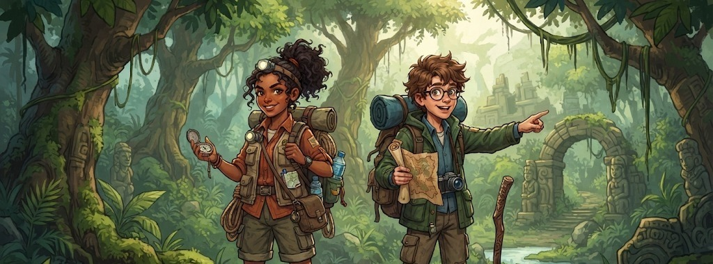

# COMIC ESCAPE: Shadows of the Forgotten
### A 15-Minute Cinematic Comic-Based 3D Escape Room Experience



**Comic Escape: Shadows of the Forgotten** is an immersive browser-based 3D escape room game combining comic-book storytelling, tactile environmental puzzles, multi-spectral lighting mechanics, zero-gravity antigravity levitation, and an adaptive procedural Web Audio soundscape.

---

## 🌟 Highlights & Features

- **📖 Comic-Book Narrative Mechanics**:
  - Interactive comic book clues with vintage halftone aesthetics.
  - Onomatopoeia bursts (`CLIK-CLAK!`, `VZZZT!`, `CRRR-RAAACK!`).
  - Press **`[J]`** at any time to open your **Comic Journal** and inspect discovered story panels.

- **🔦 Multi-Spectral Flashlight**:
  - **[1] White Floodlight**: Illuminates dark ancient chambers.
  - **[2] UV Blacklight**: Uncovers secret luminescent inscriptions, hidden glyphs, and ultraviolet ciphers.
  - **[3] Focused Laser**: Bends through optical mirrors and activates celestial armillary receptors.

- **🏛️ Three Handcrafted Atmospheric Chambers**:
  1. **The Forgotten Library**: Match ancient animal sigil tomes (Falcon, Serpent, Wolf) to unlock the secret archive.
  2. **The Observatory of Lost Stars**: Align optical prisms and bounce laser beams across celestial armillary spheres.
  3. **The Temple of Living Shadows**: Balance the Sun and Moon fire braziers to project the sacred shadow equilibrium.

- **⚡ The Master Exit Twist**:
  - A dramatic plot-twist finale at the colossal north portal revealing the hollow lock facade and the ancient architects' psychological trap.

- **🔊 Procedural Web Audio Engine**:
  - **Granular Stone Grinding**: Dual-filter Brownian noise capturing heavy granite friction, sub-bass seismic mass, and seating impacts.
  - **Violent Wall Cracking**: Multi-phase acoustic stress fracture snaps, tectonic fissures, and tumbling rubble.
  - **Modal Metallic Key Resonances**: Distinct acoustic signatures for Antique Brass (warm inharmonic bells), Astral Silver (crystalline singing bowl shimmer), and Obsidian (sacred Tibetan temple gong).
  - **Tibetan Singing Bowls**: Acoustic beating tremolo pulsing at 528Hz and 432Hz sacred harmonics.
  - **Interactive Soundboard**: Test all sound effects directly from the Pause menu (`[ESC]`).

- **⏱️ 15-Minute Tactical Countdown & Autosave**:
  - Real-time countdown timer with state persistence in `localStorage`.

---

## 🎮 How to Play & Controls

| Action | Keyboard / Mouse | Touch Controls |
| :--- | :--- | :--- |
| **Move** | `W`, `A`, `S`, `D` | Virtual D-Pad (Bottom-Left) |
| **Look / Aim** | `Mouse` | Screen Drag |
| **Interact / Inspect** | `E` | `[E]` Button |
| **Toggle Flashlight** | `F` | `🔦` Button |
| **Flashlight Modes** | `1` (White), `2` (UV), `3` (Laser) | `1/2/3` Button |
| **Comic Journal** | `J` | HUD `[📖 JOURNAL]` |
| **Tactical Hints (3-Tier)** | `H` | HUD `[💡 HINTS]` |
| **Mission Settings / Audio** | `ESC` | HUD `[⚙️]` |

---

## 🛠️ Technology Stack

- **Graphics**: [Three.js](https://threejs.org/) (WebGL 3D Engine, PointerLockControls, Custom Materials)
- **Audio**: Web Audio API (100% Procedural synthesis — zero external MP3 dependencies)
- **Bundler**: [esbuild](https://esbuild.github.io/)
- **UI & Design**: Vanilla CSS with glassmorphism, responsive layout, Google Fonts (*Cinzel*, *Space Mono*, *Inter*)

---

## 🚀 Running Locally

1. Clone the repository:
   ```bash
   git clone https://github.com/Malleeswari-software/ComicEscape.git
   cd ComicEscape
   ```

2. Start a local HTTP server:
   ```bash
   # Using Python 3
   python -m http.server 8888
   ```
   *Or using Node.js:*
   ```bash
   npx serve .
   ```

3. Open your browser at:
   ```
   http://localhost:8888
   ```

---

## 📦 Building the Bundle

To recompile the JavaScript bundle after making edits:

```bash
npm run build
```

---

## 🎮 Play Online (Itch.io)

Play the official browser build directly on itch.io:
👉 **[Play Comic Escape on Itch.io](https://malleeswari.itch.io/comic-escape)**  
*(Also accessible via your itch.io dashboard project page)*

---

## 👥 Team & Development Roles

- **Thadikonda Malleeswari (Chinnu)** — *Solo Developer, Game Designer, Creative Director, Gameplay Programmer, and Puzzle Architect.*

---

## 🤖 AI Disclosure (Game Jam Rule B)

In compliance with Game Jam Rule B (AI Disclosure and Originality):
- **Code & Logic Assistance**: Antigravity IDE powered by Google Gemini LLM was used for pair-programming, Three.js WebGL integration, procedural Web Audio synthesis algorithms, and bug fixing.
- **Visual Illustrations & Covers**: Google Imagen / DeepMind AI generation within Antigravity was used for comic chapter covers and cinematic cutscene storyboards.
- **Original Creative Contribution**: All core game concepts, chamber narrative architecture (*The Decoy Key Conspiracy*), multi-spectral flashlight mechanics (White/UV/Laser), Zero-G flight design, 3D chamber layouts, and puzzle rules (Falcon/Serpent/Wolf, optical laser reflection, Sol/Luna shadow balance) were designed, directed, and integrated by the developer.

---

## 📜 Credits & Asset Licensing (Game Jam Rule A)

- **No Paid Assets**: Zero third-party paid assets were used in this project.
- **Open-Source Libraries**: Three.js (MIT), PointerLockControls (MIT), esbuild (MIT).
- **Open-Source Fonts**: *Cinzel*, *Outfit*, *Space Mono*, and *Bangers* (SIL Open Font License 1.1 via Google Fonts).
- **Procedural Content**: 100% of 3D geometry is procedurally generated with Three.js primitives; 100% of audio is procedurally synthesized via the Web Audio API.
- For complete licensing details and source links, please review [CREDITS.md](CREDITS.md).

---

## 📜 License

Created for the **The Escape Protocol** interactive project.
All rights reserved © 2026.

